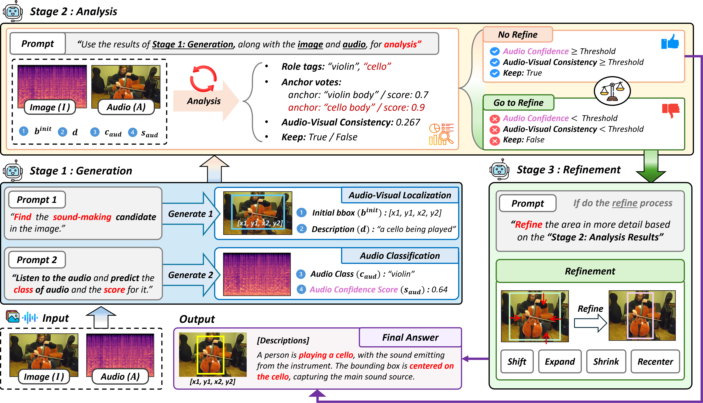

# GAR-SSL

**Generate, Analyze, and Refine: Training-Free Sound Source Localization via MLLM Meta-Reasoning**

Official repository for the project page and source code of **GAR-SSL**.

---

## Links

- **Project Page**: https://visualaikhu.github.io/GAR-SSL/
- **Paper**: https://arxiv.org/pdf/2604.06824
- **arXiv**: https://arxiv.org/abs/2604.06824
- **Code**: https://github.com/VisualAIKHU/GAR-SSL/code

---

## Authors

- **Subin Park**
- **Jung Uk Kim***  

Kyung Hee University  

\* Corresponding author

---

## Abstract

Sound source localization task aims to identify the locations of sound-emitting objects by leveraging correlations between audio and visual modalities. Most existing SSL methods rely on contrastive learning-based feature matching, but lack explicit reasoning and verification, limiting their effectiveness in complex acoustic scenes.

Inspired by human meta-cognitive processes, we propose a training-free SSL framework that exploits the intrinsic reasoning capabilities of Multimodal Large Language Models (MLLMs). Our Generation-Analysis-Refinement (GAR) pipeline consists of three stages: **Generation** produces initial bounding boxes and audio classifications; **Analysis** quantifies Audio-Visual Consistency via open-set role tagging and anchor voting; and **Refinement** applies adaptive gating to prevent unnecessary adjustments.

Extensive experiments on single-source and multi-source benchmarks demonstrate competitive performance.

---

## Overview

GAR-SSL reformulates sound source localization as a **meta-reasoning process** rather than direct audio-visual feature matching.

<p align="center">
  <br>
  <em>Generation-Analysis-Refinement Sound Source Localization (GAR-SSL) framework. Given an image-audio pair, the model performs three meta-reasoning steps: Generation produces an initial bounding box and audio label, Analysis evaluates Audio-Visual Consistency through role-based reasoning, and Refinement adjusts the localization to obtain a fine-grained final bounding box. This process enables explainable and training-free audio-visual localization.</em>
</p>

The proposed pipeline consists of three main stages:

1. **Generation**  
   The MLLM predicts initial bounding boxes for sound-emitting objects and estimates audio classes.

2. **Analysis**  
   The framework evaluates Audio-Visual Consistency using open-set role tagging and anchor voting.

3. **Refinement**  
   Adaptive gating determines whether refinement is necessary and applies conservative bounding box adjustment only when needed.

---


## Project Structure

```
GAR-SSL/code/
├── run_all.sh              # Script for running all/individual datasets
│
├── GAR_music_solo.py       # MUSIC Solo evaluation
├── GAR_music_duet.py       # MUSIC Duet evaluation
├── GAR_vggss_single.py     # VGGSound Single evaluation
├── GAR_vggss_duet.py       # VGGSound Duet evaluation
│
├── model_utils.py          # Model loading / inference / JSON parsing / Anchor Voting
├── bbox_utils.py           # Bounding box operations (clip, clamp, ops, denorm, IoU)
├── evaluator.py            # cIoU evaluation class
├── data_utils.py           # Per-dataset GT JSON loader
├── prompts_single.py       # Prompt builder for Solo/Single
└── prompts_duet.py         # Prompt builder for Duet
```

---

## Pipeline Overview

Each script consists of 3 stages + gating.

<p align="center">
  <br>
  <em>The proposed training-free framework consists of three stages: (i) Generation produces initial bounding boxes and audio classifications from image-audio pairs; (ii) Analysis evaluates consistency through role tagging, anchor voting, and scoring, repeated $N$ times for consensus; (iii) Refinement applies adaptive gating and geometric operations to adjust localization. All operations are performed via MLLMs prompt engineering without training.</em>
</p>

```
Stage A  : IMAGE + AUDIO  →  bbox prediction (initial location)
Stage B-1: AUDIO only     →  audio_class + confidence prediction
Stage B-2: Anchor Voting  →  av_consistency / keep decision (consensus after n iterations)
Gating   : keep=True & av ≥ τ_av & audio_conf ≥ τ_audio  →  skip refinement
Stage C  : IMAGE + AUDIO  →  bbox refinement (ops-based, conservative clamp)
```

---


## Qualitative Results

<p align="center">
  <br>
  <em>Qualitative localization results on VGGSound-Duet and MUSIC-Duet.</em>
</p>

<p align="center">
  <br>
  <em>Qualitative localization results on VGGSound-Single and MUSIC-Solo.</em>
</p>


---


## Data Path Structure

```
/data/user/
├── MUSIC/
│   ├── solo/test/frames/       # *.jpg
│   └── solo/test/audio/        # *.wav
│   ├── duet/test/frames/
│   └── duet/test/audio/
├── VGGSound/
│   └── test/frames/ & audio/
├── VGGSound_duet/
│   ├── test/frames/ & audio/
│   └── vggss_duet_test.json
└── metadata/
    ├── music_solo.json          # [{file, bbox:[x,y,w,h]}, ...]     normalized xywh
    ├── music_duet.json          # [{file, bbox_src1, bbox_src2, class_src1, class_src2}, ...]
    └── vggss.json               # [{file, bbox:[[x1,y1,x2,y2]]}, ...]  normalized xyxy
```

---

## How to Run

### Run all datasets sequentially

```bash
cd /data/user/GAR-SSL/code
bash run_all.sh            # N_VOTES=5 (default)
bash run_all.sh all 5      # specify N_VOTES=5
```

### Run a specific dataset only

```bash
bash run_all.sh music_solo           # N_VOTES=5 (default)
bash run_all.sh music_solo 3         # specify N_VOTES=3
bash run_all.sh music_duet
bash run_all.sh vggss_single
bash run_all.sh vggss_duet
```

> You can specify `N_VOTES` as the **second argument**. If omitted, the default value `5` is used.

### Direct Python execution (custom arguments)

```bash
python GAR_music_solo.py \
    --model_id    "Qwen/Qwen2.5-Omni-7B" \
    --frame_dir   "/data/user/MUSIC/solo/test/frames" \
    --audio_dir   "/data/user/MUSIC/solo/test/audio" \
    --gt_path     "/data/user/metadata/music_solo.json" \
    --out_root    "GAR-SSL/code/outputs/GAR_music_solo" \
    --cuda_device "0" \
    --n_votes     5 \
    --tau_av      0.50 \
    --tau_audio   0.75
```

---

## Argument Descriptions

| Argument | Type | Description |
|----------|------|-------------|
| `--model_id` | str | HuggingFace model ID or local path |
| `--frame_dir` | str | Input frame image directory (`.jpg`) |
| `--audio_dir` | str | Input audio directory (`.wav`) |
| `--gt_path` | str | GT JSON file path |
| `--out_root` | str | Output root directory |
| `--cuda_device` | str | GPU number to use (`"0"`, `"1"`, ...) |
| `--n_votes` | int | Number of Anchor Voting iterations (default: 5) |
| `--tau_av` | float | Stage B-2 gating threshold — av_consistency |
| `--tau_audio` | float | Stage B-2 gating threshold — audio_confidence |

### Default Gating Thresholds per Dataset

| Dataset | `--tau_av` | `--tau_audio` |
|---------|-----------|---------------|
| MUSIC Solo | 0.75 | 0.75 |
| MUSIC Duet | 0.75 | 0.50 |
| VGGSound Single | 0.50 | 0.50 |
| VGGSound Duet | 0.75 | 0.75 |

---

## Output Structure

```
outputs/GAR_<dataset>/
├── vis_original/       # Original resolution visualization (blue=pred, green=GT)
├── vis224/             # 224x224 resized visualization
├── bbox/               # Per-sample JSON results
│   └── <vid>.json
└── bbox_all.json       # Full summary JSON
```

### Per-sample JSON Structure (Solo/Single)

```json
{
  "file_id": "vid_name",
  "bbox_norm_224": [x1, y1, x2, y2],
  "description_stageA": "...",
  "description_refined": "...",
  "audio_class": "violin",
  "audio_confidence": 0.91,
  "analysis": {
    "av_consistency": 0.82,
    "role_tags": ["bow_hand", "violin_body"],
    "anchor_votes": [{"anchor": "bow_on_strings", "score": 0.9}],
    "keep": true
  }
}
```

---

## Evaluation Metrics

The following metrics are printed to the terminal upon completion.

| Metric | Description |
|--------|-------------|
| `cIoU@0.3` | Accuracy at cIoU threshold 0.3 |
| `cIoU@0.5` | Accuracy at cIoU threshold 0.5 |
| `AUC` | Area under the cIoU curve |
| `CAP` | Mean per-sample Average Precision |
| `PIAP` | Pixel-level Average Precision |
| Gating stats | Ratio of refinement executed / skipped |
