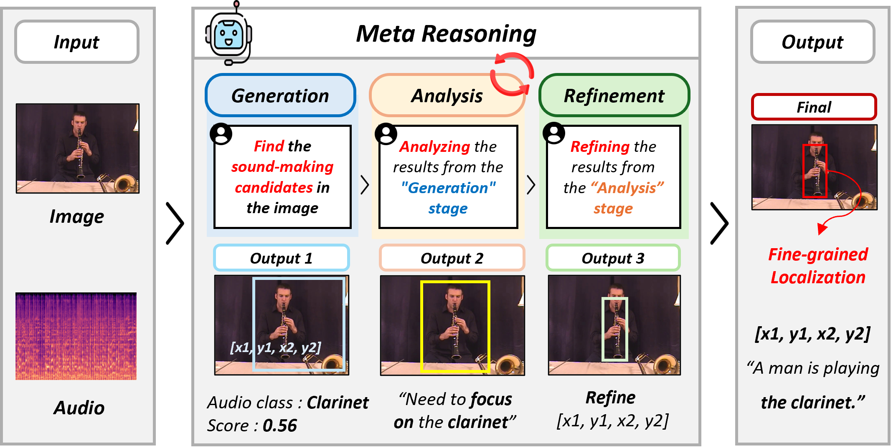

<h1 align="center">GAR-SSL</h1>

<h3 align="center">
Generate, Analyze, and Refine:<br>
Training-Free Sound Source Localization via MLLM Meta-Reasoning
</h3>

<p align="center">
  <b>Training-free sound source localization through structured MLLM meta-reasoning.</b>
</p>

<p align="center">
  
  
  
  
</p>

<p align="center">
  🌐 <a href="https://visualaikhu.github.io/GAR-SSL/">Project Page</a> &nbsp;|&nbsp;
  📄 <a href="https://arxiv.org/pdf/2604.06824">Paper</a> &nbsp;|&nbsp;
  🔗 <a href="https://arxiv.org/abs/2604.06824">arXiv</a> &nbsp;|&nbsp;
  💻 <a href="https://github.com/VisualAIKHU/GAR-SSL">Code</a>
</p>

<p align="center">
  <b>Subin Park</b>, <b>Jung Uk Kim*</b><br>
  Kyung Hee University, <a href="https://visualai.khu.ac.kr/">Visual AI Lab.</a><br>
  * Corresponding author
</p>

---

## Overview

<p align="center">
  <br>
  <em>
  Overview of the proposed GAR-SSL framework. GAR-SSL performs sound source localization through three structured reasoning steps: Generation, Analysis, and Refinement.
  </em>
</p>

GAR-SSL reformulates sound source localization as a **meta-reasoning process** rather than direct audio-visual feature matching.  
Given an image-audio pair, the framework generates initial localization results, analyzes audio-visual consistency, and refines the predicted bounding boxes only when necessary.

---

## Abstract

Sound source localization aims to identify the locations of sound-emitting objects by leveraging correlations between audio and visual modalities. Most existing SSL methods rely on contrastive learning-based feature matching, but lack explicit reasoning and verification, limiting their effectiveness in complex acoustic scenes.

Inspired by human meta-cognitive processes, we propose a **training-free SSL framework** that exploits the intrinsic reasoning capabilities of Multimodal Large Language Models (MLLMs). Our **Generation-Analysis-Refinement (GAR)** pipeline consists of three steps: **Generation** produces initial bounding boxes and audio classifications; **Analysis** quantifies audio-visual consistency via open-set role tagging and anchor voting; and **Refinement** applies adaptive gating to prevent unnecessary adjustments.

Extensive experiments on single-source and multi-source benchmarks demonstrate competitive performance.

---

## Highlights

- **Training-free framework** without task-specific model training.
- **MLLM-based meta-reasoning** for explainable sound source localization.
- **Generation-Analysis-Refinement pipeline** for structured audio-visual reasoning.
- **Adaptive gating** to avoid unnecessary refinement.
- Supports both **single-source** and **multi-source** sound localization benchmarks.

---

## Method Overview

| Step | Name | Description |
|------|------|-------------|
| 1 | **Generation** | Predicts initial bounding boxes and audio classes from image-audio pairs. |
| 2 | **Analysis** | Evaluates audio-visual consistency using role tagging and anchor voting. |
| 3 | **Refinement** | Applies adaptive gating and conservative bounding box adjustment only when needed. |

<p align="center">
  <br>
  <em>
  The proposed training-free framework consists of Generation, Analysis, and Refinement. All steps are performed through MLLM prompting without task-specific training.
  </em>
</p>

```text
Generation   : IMAGE + AUDIO  →  bbox prediction
Analysis 1   : AUDIO only     →  audio class + confidence prediction
Analysis 2   : Anchor Voting  →  audio-visual consistency / keep decision
Gating       : keep=True & av ≥ τ_av & audio_conf ≥ τ_audio  →  skip refinement
Refinement   : IMAGE + AUDIO  →  bbox refinement
```

---

## Qualitative Results

<p align="center">
  <br>
  <em>Qualitative localization results on VGGSound-Duet and MUSIC-Duet.</em>
</p>

<p align="center">
  <br>
  <em>Qualitative localization results on VGGSound-Single and MUSIC-Solo.</em>
</p>

---

## Project Structure

```text
GAR-SSL/code/
├── run_all.sh              # Script for running all/individual datasets
│
├── GAR_music_solo.py       # MUSIC Solo evaluation
├── GAR_music_duet.py       # MUSIC Duet evaluation
├── GAR_vggss_single.py     # VGGSound Single evaluation
├── GAR_vggss_duet.py       # VGGSound Duet evaluation
│
├── model_utils.py          # Model loading / inference / JSON parsing / Anchor Voting
├── bbox_utils.py           # Bounding box operations
├── evaluator.py            # cIoU evaluation class
├── data_utils.py           # Per-dataset GT JSON loader
├── prompts_single.py       # Prompt builder for Solo/Single
└── prompts_duet.py         # Prompt builder for Duet
```

---

## Data Path Structure

```text
/data/user/
├── MUSIC/
│   ├── solo/test/frames/       # *.jpg
│   └── solo/test/audio/        # *.wav
│   ├── duet/test/frames/
│   └── duet/test/audio/
├── VGGSound/
│   └── test/frames/ & audio/
├── VGGSound_duet/
│   ├── test/frames/ & audio/
│   └── vggss_duet_test.json
└── metadata/
    ├── music_solo.json
    ├── music_duet.json
    └── vggss.json
```

---

## How to Run

<details>
<summary><b>Run all datasets sequentially</b></summary>

```bash
cd /data/user/GAR-SSL/code

bash run_all.sh            # N_VOTES=5 (default)
bash run_all.sh all 5      # specify N_VOTES=5
```

</details>

<details>
<summary><b>Run a specific dataset only</b></summary>

```bash
bash run_all.sh music_solo           # N_VOTES=5 (default)
bash run_all.sh music_solo 3         # specify N_VOTES=3

bash run_all.sh music_duet
bash run_all.sh vggss_single
bash run_all.sh vggss_duet
```

</details>

<details>
<summary><b>Direct Python execution</b></summary>

```bash
python GAR_music_solo.py \
    --model_id    "Qwen/Qwen2.5-Omni-7B" \
    --frame_dir   "/data/user/MUSIC/solo/test/frames" \
    --audio_dir   "/data/user/MUSIC/solo/test/audio" \
    --gt_path     "/data/user/metadata/music_solo.json" \
    --out_root    "GAR-SSL/code/outputs/GAR_music_solo" \
    --cuda_device "0" \
    --n_votes     5 \
    --tau_av      0.50 \
    --tau_audio   0.75
```

</details>

> You can specify `N_VOTES` as the second argument. If omitted, the default value `5` is used.

---

## Arguments

| Argument | Type | Description |
|----------|------|-------------|
| `--model_id` | str | HuggingFace model ID or local path |
| `--frame_dir` | str | Input frame image directory |
| `--audio_dir` | str | Input audio directory |
| `--gt_path` | str | GT JSON file path |
| `--out_root` | str | Output root directory |
| `--cuda_device` | str | GPU number to use |
| `--n_votes` | int | Number of Anchor Voting iterations |
| `--tau_av` | float | Audio-visual consistency threshold |
| `--tau_audio` | float | Audio confidence threshold |

---

## Default Gating Thresholds

| Dataset | `--tau_av` | `--tau_audio` |
|---------|-----------:|--------------:|
| MUSIC Solo | 0.75 | 0.75 |
| MUSIC Duet | 0.75 | 0.50 |
| VGGSound Single | 0.50 | 0.50 |
| VGGSound Duet | 0.75 | 0.75 |

---

## Output Structure

```text
outputs/GAR_<dataset>/
├── vis_original/       # Original resolution visualization
├── vis224/             # 224x224 resized visualization
├── bbox/               # Per-sample JSON results
│   └── <vid>.json
└── bbox_all.json       # Full summary JSON
```

<details>
<summary><b>Per-sample JSON example</b></summary>

```json
{
  "file_id": "vid_name",
  "bbox_norm_224": [x1, y1, x2, y2],
  "description_stageA": "...",
  "description_refined": "...",
  "audio_class": "violin",
  "audio_confidence": 0.91,
  "analysis": {
    "av_consistency": 0.82,
    "role_tags": ["bow_hand", "violin_body"],
    "anchor_votes": [
      {
        "anchor": "bow_on_strings",
        "score": 0.9
      }
    ],
    "keep": true
  }
}
```

</details>

---

## Evaluation Metrics

| Metric | Description |
|--------|-------------|
| `cIoU@0.3` | Accuracy at cIoU threshold 0.3 |
| `cIoU@0.5` | Accuracy at cIoU threshold 0.5 |
| `AUC` | Area under the cIoU curve |
| `CAP` | Mean per-sample Average Precision |
| `PIAP` | Pixel-level Average Precision |
| Gating stats | Ratio of refinement executed / skipped |

---

## Citation

```bibtex
@article{park2026garssl,
  title={Generate, Analyze, and Refine: Training-Free Sound Source Localization via MLLM Meta-Reasoning},
  author={Park, Subin and Kim, Jung Uk},
  journal={arXiv preprint arXiv:2604.06824},
  year={2026}
}
```

---

## Acknowledgement

This project is developed by Visual AI Lab at Kyung Hee University.
